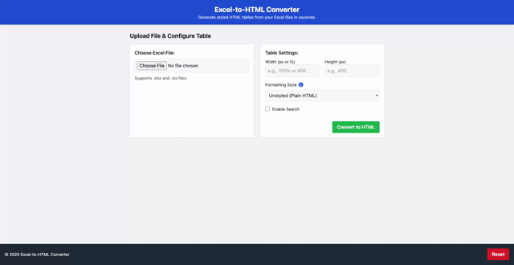

# Excel-to-HTML Table Converter

Convert Excel spreadsheets into clean, copyable HTML tables — with selectable formatting options and instant preview.

**Live application:** [https://evperkinsjr.github.io/excel-to-html-converter/](https://evperkinsjr.github.io/excel-to-html-converter/)

## 🌟 Overview

This tool helps users upload an `.xlsx` file, extract data, and convert it into an HTML table with optional styling. Whether you're preparing documentation, prototyping UI elements, or sharing structured data on the web, this converter provides a quick and accessible way to generate readable, standards-friendly tables.

Built with modular JavaScript and styled with [Tailwind CSS](https://tailwindcss.com/), the application also offers scoped integration of [USWDS](https://designsystem.digital.gov/) for developers working on U.S. federal projects.

---

## ✨ Features

- ✅ **Excel Upload & Preview**  
  Drag-and-drop or select an `.xlsx` file. Preview your table before exporting.

- 🎨 **3 Formatting Options**  
  Choose between:
  - **Unstyled** (plain HTML)
  - **Tailwind CSS**
  - **U.S. Web Design System (USWDS)** (scoped and dynamically loaded)

- 🧰 **Customizable Table Settings**  
  - Set table width and height
  - Enable client-side search box (Tailwind/unstyled only)
  - Sorting support in preview (USWDS tables only)

- 📋 **Export-Ready HTML Output**  
  Copy the generated markup or paste it directly into your project. An **Export Guide** tooltip helps you decide how to integrate styled tables into your environment.

- 🔐 **Input Validation & Error Handling**  
  - Rejects unsupported file types
  - Handles corrupted or empty spreadsheets gracefully
  - Notifies users with accessible toast-style alerts

- 🧑‍🦯 **Accessibility Features**
  - Keyboard navigation support
  - Screen reader-friendly structure
  - ARIA attributes and semantic HTML
  - Accessible modals and notifications

- 🧼 **Reset Button**  
  Always accessible in the footer. Resets the app to its initial state without a page reload.

---

## 📸 Demo Preview



> *Note: Preview sorting is powered by the USWDS library and only works within the app. Exported HTML is static unless you include your own table-sorting JavaScript.*

---

## 🚀 Getting Started

### 1. Clone the Repository

```bash
git clone https://github.com/your-username/excel-to-html-converter.git
cd excel-to-html-converter
```

### 2. Open in Live Server

This project requires a local server due to browser restrictions when reading files. If you use VS Code:

1. Install the **Live Server** extension.
2. Right-click `index.html` → `Open with Live Server`.

> Alternatively, host via Python, Node.js, or deploy to GitHub Pages.

---

## 📁 Project Structure

```
excel-to-html-converter/
├── index.html
├── styles.css
├── uswds-preview.css
├── js/
│   ├── main.js
│   ├── fileReader.js
│   ├── htmlGenerator.js
│   ├── tableFormatter.js
│   ├── uiController.js
│   └── utils.js
└── examples/
    └── sample.xlsx
```

Each JS module handles a specific responsibility — allowing for easy maintenance, extension, or testing.

---

## 🧠 Design Principles

- **User First**: Clear guidance and guardrails for non-technical users
- **Separation of Concerns**: Modular JS, styling isolation (scoped USWDS), and graceful degradation
- **Accessibility by Default**: Structured navigation, focus control, and notification support
- **Deployment-Ready**: Lightweight, portable, and hostable as a static app

---

## 🛠 Deployment

This app is designed to run as a **static site**, making it ideal for:
- [GitHub Pages](https://pages.github.com/)
- [Netlify](https://www.netlify.com/)
- [Vercel](https://vercel.com/)

**GitHub Pages instructions**:
1. Push your project to a GitHub repository
2. Go to `Settings > Pages`
3. Select the `main` branch and `/root` as the source
4. Save and deploy

The live site will be available at:
```
https://your-username.github.io/excel-to-html-converter/
```

---

## 📌 Notes

- Sorting is limited to the preview area. To enable sorting in production, include a table library or the [USWDS JS bundle](https://designsystem.digital.gov/documentation/developers/#javascript).
- Some advanced table features (like search or filtering) may require custom JS depending on your deployment environment.

---

## 📄 License

MIT License — free for personal or commercial use.

---

## 🙌 Acknowledgments

- [SheetJS](https://sheetjs.com/) for Excel parsing
- [Tailwind CSS](https://tailwindcss.com/)
- [U.S. Web Design System (USWDS)](https://designsystem.digital.gov/)
